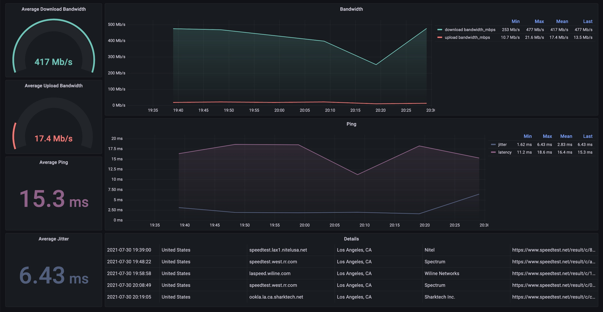

# speedtest

Easy to setup monitoring tool/dashboard for internet speedtest results.

## Usage

`Docker` is the only dependency for this project.
Clone this repository and run the following command:

### `docker compose up -d`

> Optionally configure the `.env` file with different parameters e.g. the interval between speedtests.
> The dashboard and database web interfaces will be available on `http://localhost:3000` and `http://localhost:8086` respectively.

## How It Works

[Docker Compose](https://docs.docker.com/compose/) will start 3 containers:

1. `speedtest-runner`: python script which will run an [Ookla Speedtest](https://www.speedtest.net/) at the specified interval and write results to the time-series database
2. `influx-database`: [InfluxDB](https://www.influxdata.com/products/influxdb/) time-series database
3. `grafana-dashboard`: [Grafana](https://grafana.com/grafana/dashboards) dashboard for speedtest result visualizations

> The Docker [restart policy](https://docs.docker.com/engine/reference/run/#restart-policies---restart) for each container is set to `always` meaning the Docker daemon will start
> these containers as a service each time it starts up, i.e. the service will always be available unless explicitly stopped; it will then restart the next time the Docker daemon 
> starts up.
