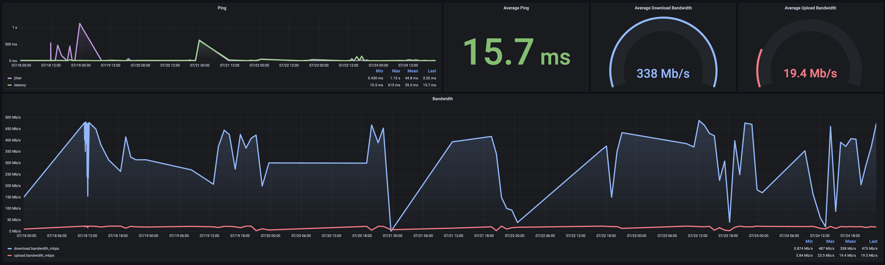

# speedtest

Easy to setup monitoring tool/dashboard for internet speedtest results.

## Run

Docker is the only dependency for this project.

1. Clone this repository
2. Optionally configure the `.env` file w/ different parameters e.g. the interval between speedtests
3. Run `docker compose up -d` to start the background process
4. Visualize speedtest results at `http://localhost:3000`

This will start 3 docker containers:

1. `speedtest-runner`: python script which will run an Ookla speedtest at the specified interval and writes results to the time-series database
2. `influx-database`: time-series database (accessible at `http://localhost:8086`)
3. `grafana-dashboard`: grafana dashboard for speedtest result visualizations (accessible at `http://localhost:3000`)

The Docker [restart policy](https://docs.docker.com/engine/reference/run/#restart-policies---restart) for each container is set to `always` meaning the Docker daemon will start these containers as a service each time it starts up, i.e. the service will always be available unless explicitly stopped; it will then restart the next time the Docker daemon starts up.
